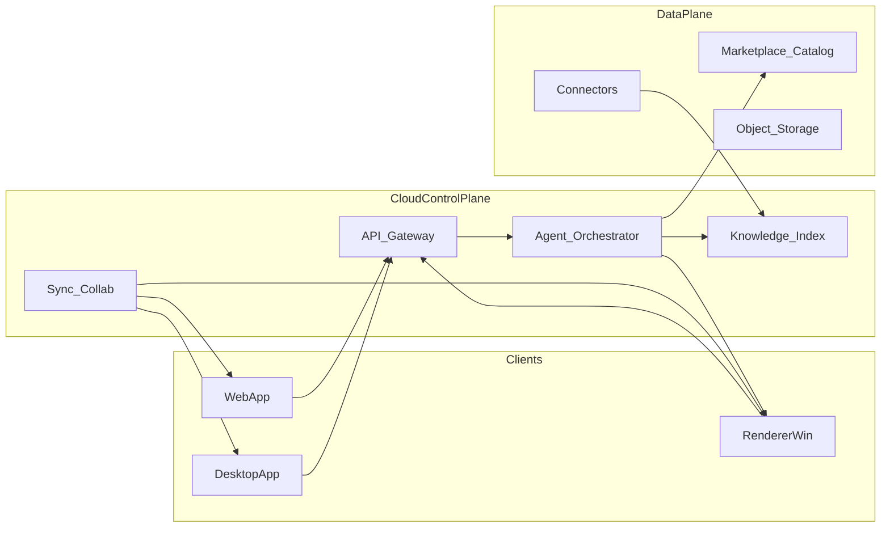

# Codesign 工作流：架构与落地计划

## 1. 产品定位与核心闭环

**一句话**：把「背景与规范理解 → 发散与方案结构化 → 可验证的素材/场景落地 → 渲染与交付」串成一条可追溯链路，且团队与个人资料可统一被模型与规则调用。

建议拆成三条并行价值线（便于排期与验证）：

- **知识线**：项目背景、场地条件、任务书、参考图、历史项目、企业标准/图集 → 检索增强生成（RAG）+ 结构化「设计约束卡片」（用地红线、风格词表、材料等级、预算档位等）。
- **资产线**：对话与方案输出中**显式绑定**素材平台 SKU / 资源 ID / 标签体系，并在渲染器内**深链定位**（选中、替换、批量应用）。
- **执行线**：自然语言 → **受控动作**（布置场景、切换搭配、触发 5s 镜头视频、批量出图），由渲染器客户端执行并回传状态/缩略图/日志。

---

## 2. 多源资料输入：个人 + 团队 + 大体量 + 多格式

### 2.1 统一「资料源」抽象（Connector 模型）

为每一种存储形态实现 **Connector**，对外只暴露能力：`列举 / 增量同步 / 权限校验 / 拉取内容 / 事件订阅（可选）`。

| 类型            | 典型场景      | 技术要点                                   |
| ------------- | --------- | -------------------------------------- |
| 本机 / 指定文件夹    | 个人积累、项目目录 | 桌面端 Agent 或同步守护进程；大文件分块哈希增量            |
| 局域网 NAS / SMB | 事务所内网盘    | 仅在可信网络或 VPN 下索引；敏感数据可选「指纹+元数据上云，原文不上云」 |
| 网盘（多厂商）       | 外协、客户资料   | OAuth + delta API；注意 API 限流与合规         |
| 对象存储 / 你们素材平台 | 已购资产、企业库  | 与目录 API、订单/授权打通，避免未授权素材进入生成上下文         |

### 2.2 索引与检索策略（兼顾效果与成本）

- **分层索引**：元数据（路径、项目、标签、作者、时间）→ 全文/版面（PDF/OFD）→ **视觉嵌入**（参考图、效果图、实景照片）→ **CAD/BIM 轻量摘要**（若暂不解析几何，可先索引图层名、块名、属性）。
- **大文件策略**：Office/PDF 分页分块；点云/超大模型走「摘要 + 关键截图/剖面导出」由渲染器或专用微服务生成，再入索引。
- **权限**：资料集（Collection）级 ACL；团队空间与项目空间分离；AI 上下文默认**仅注入用户有权访问的 chunk**。

### 2.3 「快速引用」产品形态

- 拖拽文件夹 / 选择网盘目录 → 后台异步索引，前台即时可用「已扫描文件名+摘要」做粗检索。
- 对话中 `@项目A / @标准库 / @某文件夹` 限定范围。
- 企业版：**规范包**（一键导入公司模板 + 禁止词 + 材料白名单）。

---

## 3. 与渲染器、素材平台的深度关联

### 3.1 资产图谱（Asset Graph）

在云端维护 **逻辑资产 ID** 与多端映射：

- 素材平台：`listing_id`、分类、标签、授权范围、预览 URL。
- 渲染器：内部 `asset_uid`、材质变体、预设组合（你们若已有「搭配」概念可直接映射）。

对话与方案输出使用 **稳定 ID**，UI 上展示缩略图与「在渲染器中打开」深链（自定义 URL Scheme 或本地端口 + token）。

### 3.2 推荐与生成的一致性

- 检索侧：用户许可范围内，优先召回 **已购买 / 企业库 / 免费可用** 素材。
- 生成侧：系统提示词约束「不得编造不存在的 SKU」；若模型输出虚构 ID，后置 **校验 + 自动替换为最近邻真实素材**（向量检索目录）。

### 3.3 可控自动化（Action Layer）

采用 **工具调用（function calling）+ 渲染器插件协议**，而非纯自然语言透传：

- 标准动作枚举示例：`place_assets`, `apply_style_pack`, `set_camera`, `render_still`, `render_video_clip`, `replace_selection`, `sync_workset`。
- 每条动作：**JSON Schema 校验、幂等 id、预览 diff（可选）、用户确认策略**（高敏操作需显式确认）。
- Windows 客户端常驻 **本地执行器**（Local Executor）：轮询或 WebSocket 接收任务，调用现有渲染器 API/脚本层；结果回传缩略图、工程增量、错误码。

安全：设备配对、短期 token、操作审计日志。

---

## 4. 协作与同步：实时 + 延迟并存

- **会话与文档状态**：对话线程、方案文档（Markdown/结构化块）、引用资料集合 —— 适合用 **OT/CRDT** 或成熟实时文档服务，支持「有人正在编辑」与版本历史。
- **与渲染器工作集对齐**：工作集 ID 映射到协作空间；**大场景/重资产**采用延迟同步（任务队列 + 变更集），**评论、标注、镜头列表**等轻量数据实时同步。
- **通知**：关键动作完成（视频导出、场景布置失败）走推送 + 会话内系统消息。

---

## 5. 扩展性：用户可选关联其他产品

- **集成注册表**：OAuth2、Webhook、MCP（若面向极客用户）、或 **Zapier/Make 类** 低频场景。
- **开放接口**：`ingest_url`、`export_brief`、`trigger_action` 三类 API，第三方只做数据源或接收交付物。
- **插件边界**：第三方**默认不直接操作渲染器**；通过你们的 Action Layer 白名单能力暴露。

---

## 6. 端形态：Web + 桌面、跨系统、跨端同步

- **Web**：协作、检索、轻量预览、购买跳转素材平台；无本地盘时仍可工作。
- **桌面**（Win 优先，后续 macOS）：本机文件夹监视、渲染器联动、离线队列、局域网 Connector；可用 **Tauri 2 / Electron** + 共享前端代码库。
- **账号与同步**：统一身份（SSO 可选）；加密同步令牌；敏感企业数据区域部署选项可在商业化阶段提供。

---

## 7. 分阶段路线图（建议）

**Phase A — 验证闭环（8–12 周量级，视团队规模浮动）**

- Web 端：项目空间 + 上传/网盘一种 Connector + RAG 对话 + 引用来源展示。
- 素材平台：目录只读 API + 对话内推荐卡片（真 ID）。
- 渲染器：**最小动作集**（打开工程、应用预设、导出单帧），单设备试点。

**Phase B — 团队与大体量**

- 团队库 ACL、异步索引队列、LAN Connector（元数据优先模式）。
- 工作集与协作空间映射；延迟同步大资产。

**Phase C — 自动化与生态**

- 视频片段、批量搭配、diff 预览与回滚。
- 第三方集成注册表与审计。

---

## 8. 关键风险与应对

- **格式长尾**：优先 PDF/图片/Office/CAD 元数据；BIM 深度几何后移或与合作伙伴集成。
- **幻觉与错误素材**：强制 ID 校验 + 检索 grounding + 用户侧「一键替换」。
- **数据主权**：企业客户常要求「索引与原文分离」或专有云；架构上 Connector 与索引服务解耦可满足。
- **跨端安全**：本地执行器最小权限、操作确认、全链路审计。

---

## 9. 需要你方在早期对齐的决策（不影响本计划方向，但影响实现细节）

- 渲染器侧是否已有 **稳定脚本/API**（Python/C#/插件）用于无人值守布置与出图；若无，Phase A 需并行排期「自动化 API 薄封装层」。
- 素材平台是否已有 **资源唯一 ID、授权、搜索 API**；这是资产图谱与推荐的基础。
- 首波目标客户更偏 **SaaS 公有云** 还是 **设计院专有云/LAN 优先**（决定默认 Connector 策略与合规设计深度）。

以上三点若已具备，Phase A 技术风险显著降低；若部分缺失，应在路线图里为「平台侧 API 补齐」单独留带宽。